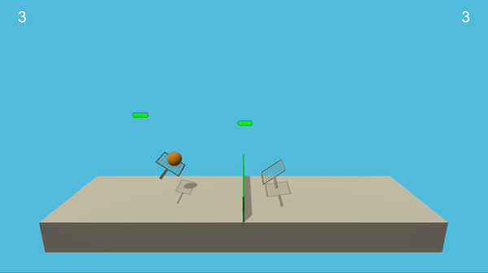

# Tennis Project (Collaboration and Competition): 

Collaboration and Competition project by Udacity for the Deep Reinforcement Learning Nanodegree

## Introduction

For this project, we will be working with the [Tennis](https://github.com/Unity-Technologies/ml-agents/blob/master/docs/Learning-Environment-Examples.md#tennis) environment.



In this environment, two agents control rackets to bounce a ball over a net. If an agent hits the ball over the net, it receives a reward of +0.1.  If an agent lets a ball hit the ground or hits the ball out of bounds, it receives a reward of -0.01.  Thus, the goal of each agent is to keep the ball in play.

The observation space consists of 8 variables corresponding to the position and velocity of the ball and racket. Each agent receives its own, local observation.  Two continuous actions are available, corresponding to movement toward (or away from) the net, and jumping. 

## Solving criterias 

The task is episodic, and in order to solve the environment, your agents must get an average score of +0.5 (over 100 consecutive episodes, after taking the maximum over both agents). Specifically,

- After each episode, we add up the rewards that each agent received (without discounting), to get a score for each agent. This yields 2 (potentially different) scores. We then take the maximum of these 2 scores.
- This yields a single **score** for each episode.

The environment is considered solved, when the average (over 100 episodes) of those **scores** is at least +0.5.

## Agent Implementation (Learning Algorithm)

The learning algorithm used is the actor-critic method **Multi Agent Deep Deterministic Policy Gradient (MADDPG)**, which is based on the DDPG algorithm we used in the previous project and extended to be suitable for multiple competetive and collaborative agents.

The DDPG algorithm uses two agents, an actor and a critic. Each one has two networks: a local-network and a target-network. Thus, the Q-targets method is applied for both agents with soft-update of the targets. 

For our MADDPG algorithm, we used the **centralized training with decentralized execution** approach discussed in [this paper](https://papers.nips.cc/paper/7217-multi-agent-actor-critic-for-mixed-cooperative-competitive-environments.pdf) by Lowe and Wu. Thus, we used a separate actor for each agent while using one common critic for both agents (in our implementation based on the DDPG template, we used two critics with same initial parameters, thus by passing identical training data for both of them we simulate the centralized critic).

Furthermore, as discussed in Udacity's course, the critic uses extra information that is not used by actors (for execution). In fact, the actions and state observations from all agents are used as input to the critic, while each actor receives only the state observed by its corresponding agent. Thus each agent takes actions based on its own observations of the environment.

Also, a shared ReplayBuffer is used for both agents (named **GLOBAL_MEMORY** in the provided code) to improve the training.

This algorithm is set to run 6000 episodes, for each episode it iterates until the environment is done. 

The main operations performed with each episode are: 
- Initializing the environment.
- Getting initial states (for both agents).
- Navigating the environment until it's done:
	- passing current states of each agent to its actor (getting corresponding actions for each agent)
	- performing actions
	- getting rewards, next-states, and dones
	- we add up the rewards that each agent received (without discounting), then we take the maximum of these 2 scores
	- we save the tuple (states, actions, rewards, next-states, dones) in the GLOBAL_MEMORY (shared ReplayBuffer)
	- training all the agents: here we train each actor with its own agent's observation, while we train the critic with the full observation of the environment (as seen by both agents)
	- next-states become current states of the environment
	- break if environment done, loop otherwise
- saving the "maximum reward over both agents" as our score and update the max reward.
- after reaching 100 episodes, if average score is greater than +0.5 then the environment is considered solved. 


As an addition, to treat the exploration-exploitation tradeoff, we started the training with a high noise to favor exploration at the first stages of the training, then we decay the noise progressively as the agent is supposed to gain more experience and thus we favor exploitation. 
This "noise dacaying" process is performed with tunable parameters starting by EPS_START and decaying to until EPS_FINAL during EPS_EP_END episodes.

### Architecture 

The state space observed by each agent has 24=state_size dimensions which is the input of both actors (corresponding to each agent), while the input of their common critic is 48 corresponding to both states observed by both agents, then the actions taken by both agents are passed to the second layer of the critic as well. 

Since we're not dealing with images, the only type of layers used is Fully Connected layers. Thus, the architecture of the network and the chosen number of layers/neurons is described as follows: 

- **Actor Neural Network architecture:** 
Input layer: with 24 units (state_size=24) 
Two fully connected Hidden layers: with 256 units, 128 units respectively 
Output layer: with 2 units (action_size=2) 

Furthermore, relu activation is used for both first and second layers, and tanh activation is used with the last layer to ensure actions are in range [-1, 1].

Thus, the forward mapping is: 
Input layer (24 units) -> Fully Connected Layer (256 units, Relu activation) -> Fully Connected Layer (128 units, Relu activation) -> Output layer (2 units, tanh activation) 

- **Critic Neural Network architecture:** 
Input layer: with 48 units (2*state_size=48) 
Two fully connected Hidden layers: with 256+2*2=260 units, 128 units respectively 
Output layer: with 1 units

Furthermore, relu activation is used for both first and second layers, and result of the first layer is concatenated with the actions taken by both agents (2*action_size). 

Thus, the forward mapping is: 
Input layer (48 units) -> Fully Connected Layer (256 units, Relu activation) + concatenate result with actions (256+2*action_size) -> Fully Connected Layer (128 units, Relu activation) -> Output layer (1 unit) 


### Hyperparameters 

The hyperparameters used in our MADDPG implementation are:

- Maximum number of episodes: 6000 
- BUFFER_SIZE = int(1e5)  # replay buffer size
- BATCH_SIZE = 256        # minibatch size
- GAMMA = 0.99            # discount factor
- TAU = 1e-2              # for soft update of target parameters
- LR_ACTOR = 2e-4         # learning rate of the actor 
- LR_CRITIC = 1e-3        # learning rate of the critic
- WEIGHT_DECAY = 0        # L2 weight decay
- RANDOM_SEED = 2         # seed used in the implementation
- OUNoise.sigma = 0.2     # noise parameter, volatility
- OUNoise.theta = 0.15    # noise parameter, speed of mean reversion
- OUNoise.mu = 0          # noise parameter, long-running mean
- EPS_START = 5.0         # initial epsilon value (noise decaying)
- EPS_EP_END = 400        # number of episodes until noise decaying stops 
- EPS_FINAL = 0           # final epsilon value (noise decaying)
- Optimizer: Adam


## Results
The results presented bellow meet the project's expectation, as our agents are able to get an average reward of at least +0.5 over 100 episodes. This performance is reached within 1573 episodes.

```
Episode 100	Average Score: 0.000	Score: 0.000	Max Score: 0.000
Episode 200	Average Score: 0.000	Score: 0.000	Max Score: 0.000
Episode 300	Average Score: 0.007	Score: 0.100	Max Score: 0.100
Episode 400	Average Score: 0.014	Score: 0.090	Max Score: 0.100
Episode 500	Average Score: 0.027	Score: 0.000	Max Score: 0.200
Episode 600	Average Score: 0.016	Score: 0.000	Max Score: 0.200
Episode 700	Average Score: 0.055	Score: 0.000	Max Score: 0.300
Episode 800	Average Score: 0.040	Score: 0.090	Max Score: 0.300
Episode 900	Average Score: 0.087	Score: 0.100	Max Score: 0.300
Episode 1000	Average Score: 0.088	Score: 0.200	Max Score: 0.300
Episode 1100	Average Score: 0.096	Score: 0.200	Max Score: 0.300
Episode 1200	Average Score: 0.095	Score: 0.100	Max Score: 0.300
Episode 1300	Average Score: 0.110	Score: 0.100	Max Score: 0.300
Episode 1400	Average Score: 0.130	Score: 0.290	Max Score: 0.300
Episode 1500	Average Score: 0.238	Score: 0.300	Max Score: 1.000

Average Score of 0.508 reached. Environment solved in 1573 episodes.

```

### Plot of Rewards


## Ideas for Future Work
In this project, the training updates for both the actor and critic are performed after each iteration. A more suitable approach to consider may be to delay the training, thus updating both networks a number of times after every set of timesteps. 

Using prioritized experience replay has always proven to be useful and advised. 

In addition, although batch normalization didn't help when used for this particular project, it may be worth experimenting with using different techniques and parameters to improve the training speed and stability.

It might also be better to try other suitable multi-agent methods for this problem to address the stability issues. 

